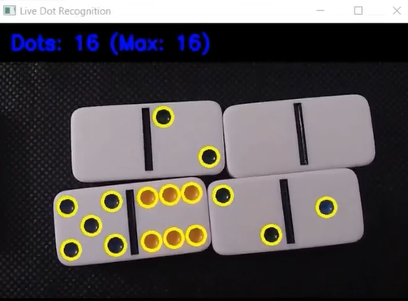
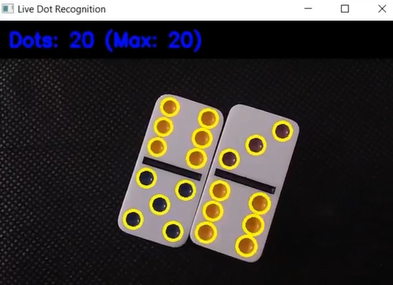

# Domino Dot Detector

This Python script detects and counts domino dots in real-time using a camera feed. The script utilizes OpenCV to process frames, detect circular blobs representing dots, and display the count on the screen.

## Features
- Real-time detection of domino dots.
- Uses OpenCV's SimpleBlobDetector for accurate dot detection.
- Ignores yellow areas to focus on dot detection.
- Displays the current and maximum detected dots.
- Rotates the camera feed for correct visualization.

## Screenshots





## Requirements
Make sure you have Python installed along with the following dependencies:

```sh
pip install opencv-python numpy
```

## How It Works
1. Captures video from the camera.
2. Converts the frame to HSV color space and removes yellow areas.
3. Detects circular blobs (dots) using OpenCV's `SimpleBlobDetector`.
4. Draws the detected dots on the frame.
5. Displays the count of current and maximum detected dots.
6. Exits on pressing the 'q' key.

## Usage
Run the script with:

```sh
python domino_dot_detector.py
```

Make sure your camera is connected and accessible. The script uses camera index `1`, but you can change it to `0` if needed.

## Code Overview
- `process_frame(frame)`: Processes the video frame, detects dots, and returns the processed image.
- `draw_thicker_blobs(image, keypoints)`: Draws circles around detected dots.
- `add_text(img, text)`: Overlays the dot count on the frame.
- `main()`: Captures video frames, processes them, and displays results.

## Controls
- Press `q` to exit the application.

## Example Output
The script will display a live window with detected dots and a count like:

```
Dots: 5 (Max: 8)
```

## License
This project is open-source and free to use :)

---
Happy Coding! 🎲

